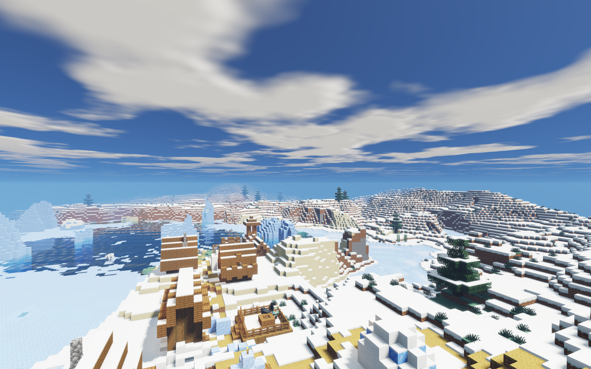
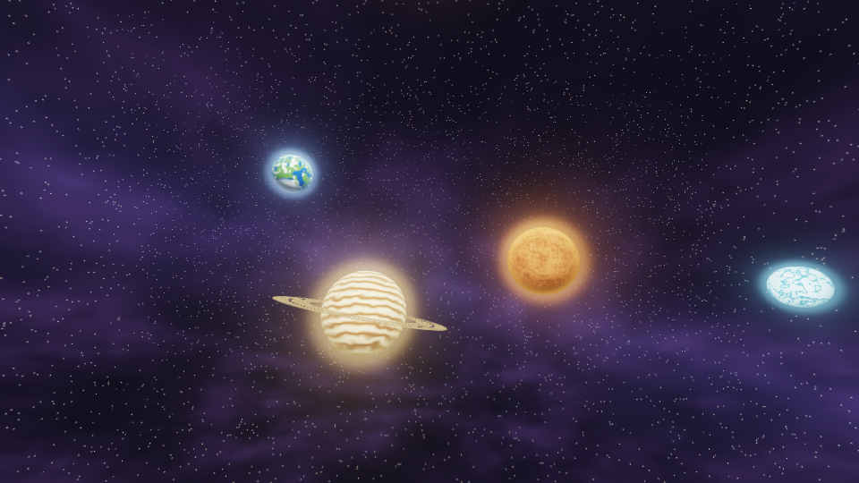

# Galaxy Shader

**Photorealistic Minecraft Shader · 1.3.0 · Community Project**

Galaxy Shader is a natural-color shader pack for Minecraft Java Edition. It uses OpenGL rasterization, shadow mapping, and screen-space effects while keeping block outlines readable. No compilation step is required, no external noise textures are needed, and no extra resource pack is required.

## Delivery status

The first feature set is implemented and has passed standalone GPU compilation and synthetic-scene render checks. Full in-game acceptance on Minecraft + Iris and measured FPS data are still pending. No claim is made about every GPU or mod combination.

## Previews

Overworld:

End planetary sky close-up:

**1.3.0 — End planet visual upgrade:** The four End planets now have independent orbits and silhouettes: inner planets orbit faster, outer ones slower, and each has its own orbital distance and apparent size; the ringed giant's rings scale with its radius. Every planet gains a procedural atmospheric glow that peaks at the silhouette, falls off into a soft haze, and keeps only a narrow rim over the disk edge so surface colors stay intact. Glow color and strength vary by planet type (cold blue ocean world, volcanic orange, amber ringed giant, icy blue outer world), with stronger scattering on the side facing the central star. The full GPU compile matrix, all synthetic-scene render regressions, and the End-sky fixture checks were rerun and passed. In-game acceptance and FPS measurements are still pending.

**1.2.0 — performance update:** Overworld cloud shadows are now evaluated per vertex and interpolated, instead of recomputed per fragment with FBM; water fragments return early before the generic lighting pass, removing work that was previously overwritten; PCF shadow sampling drops to 4 taps beyond 60% of the shadow distance, in addition to the existing distance fade. These changes passed the full GPU compile matrix and all synthetic-scene render regressions. In-game acceptance and FPS measurements are still pending.

**1.1.0 — End planetary sky:** Four orbiting planets (including one ringed giant), a central star, and a fixed starfield were added to the End. Movement is driven by view direction and time, with configurable orbital/rotational speed. `END_PLANETS` and `END_ORBIT_SPEED` options were added under a new "End starfield" menu page (Chinese and English), enabled by default and limited to the End dimension. Six synthetic-scene checks passed (foreground occlusion, orbital motion, frozen at zero speed, clock reset consistency at 0.5/1/2× speed, static when disabled, no leakage to other dimensions); in-game acceptance is still pending.

**1.0.2 — buffer format fix:** Buffer-format metadata was moved into Iris-supported multiline comments, fixing `RGBA16F` / `RGBA8` / `R11F_G11F_B10F` being treated as undefined GLSL variables in `deferred.fsh`. The validator no longer injects format macros that the release does not contain. Iris is confirmed to allocate all 7 buffers as expected.

**1.0.1 — clear-color crash fix:** Fixed a load-time crash caused by Iris parsing single-argument `vec4` clear colors. The four clear colors now use four explicit components and pass parsing against real Iris 1.10.9 and 1.11.2 releases.

## Requirements

- Target game: Minecraft Java Edition **26.2**.
- Fabric with the **Iris 1.11.2 + 26.2 Fabric build** and **Sodium 0.9.1 for 26.2**.
- OpenGL 3.3 / GLSL 330 or newer compatibility profile, converted by Iris for the game's core pipeline.
- GPU verification device for this round: NVIDIA GeForce RTX 5080 Laptop GPU, driver 616.64, OpenGL 4.6.
- Minecraft 26.3, Vulkan, OptiFine, Distant Horizons, Voxy, and custom rendering mods are not claimed to be supported.

## Installation

1. Install Minecraft Java 26.2 with the matching Fabric, Iris, and Sodium builds (or use the [Iris installer](https://irisshaders.dev/download/) and select the game version).
2. Put **Galaxy Shader-1.3.0.zip** into that instance's `.minecraft/shaderpacks/` folder. Do not extract it.
3. Launch the Fabric instance and open `Options → Video Settings → Shader Packs`.
4. Select `Galaxy Shader-1.3.0.zip` and click `Apply`.
5. Open the shader settings and choose `HIGH` or `MEDIUM`. Menu labels are provided in both Chinese and English.

The source folder is also installable: copy the whole `Galaxy Shader` directory into `shaderpacks/` so the path resolves to `shaderpacks/Galaxy Shader/shaders/shaders.properties`. Inside the ZIP, files live directly under `shaders/` with no extra nesting.

## Features

| System | Implementation |
| --- | --- |
| Lighting | Dynamic sun/moon direction, warm sunrise/sunset tint, weather attenuation, hemispheric ambient light, minimum cave brightness, held-light approximation |
| Shadows | Stable grid single orthographic shadow map, PCF, distance- and sun-elevation-based softening, normal offset, depth bias, distance fade |
| Sky | Rayleigh/Mie phase and optical-thickness approximation, sun/moon disks, stars, day-night gradient |
| End sky | Procedural planetary sky: four planets on independent orbits/speeds/sizes (including a ringed giant) with lit-side atmospheric glow, central star, fixed starfield; controlled by `END_PLANETS` / `END_ORBIT_SPEED`, End only |
| Clouds & weather | FBM cloud layer, cloud shadows, cloudiness/wind speed, wet surfaces in rain, thunder dimming, real lightning illumination |
| Water | Multi-frequency animated wave normals, rain ripples, Fresnel, sky reflection, SSR, refraction, absorption, depth tint, shore fade, underwater fog |
| Reflections | Screen-space reflections for wet or LabPBR smooth surfaces; refined ray intersections, edge fade, roughness fade, environment fallback |
| Vegetation | Grass, flowers, crops, leaves, vines; world-coordinate and gust-driven motion; matching animation for tall-plant halves and the shadow pass |
| AO / indirect | World-radius-limited screen-space AO, short-range color transport, ambient diffuse approximation |
| Materials | LabPBR normals, linear roughness, dielectric F0/metal, material AO, emissive read; vanilla parameters when no resource pack provides them |
| Emissives | Torch, lantern, soul fire, lava, redstone, sea lantern, end rod, campfire, lit furnace and other classified emissives |
| Atmospheric fog | Distance/height/weather/cave/underwater fog; warm volcanic fog in the Nether; dark nebula and void fog in the End |
| Volumetric light | Shadow-map sampling along the view ray, combined with directional phase, cloud attenuation, and fog density |
| Post-processing | HDR bright-pass, quarter-resolution downsample, two-pass Gaussian bloom, Filmic curve, gamma, saturation/contrast |
| Camera | Bounded smoothed exposure approximation, FXAA, optional depth of field and camera motion blur (both off in default presets) |

## Recommended settings and quality presets

Default is `HIGH`: 2048 shadow resolution, 128-block shadow distance, soft shadows, moderate reflections and bloom. Start at 1080p and a 16-chunk render distance, then adjust from the actual frame rate. The table below is a quality budget, not a performance guarantee.

| Preset | Shadow map / distance | Effect budget |
| --- | --- | --- |
| POTATO | 1024 / 64 | Low clouds and water, low bloom; SSR, AO, indirect and volumetric light off |
| LOW | 1024 / 96 | Low AO; SSR, indirect and volumetric light off |
| MEDIUM | 2048 / 96 | Low SSR/AO/volumetric, medium clouds and water |
| HIGH | 2048 / 128 | Default; soft shadows, moderate screen-space effects, low indirect light |
| ULTRA | 4096 / 192 | Higher sample counts, longer shadows and cloud detail |
| CINEMATIC | 8192 / 256 | Highest sample budget, screenshot DoF on; motion blur remains off |

Lowering `SSR`, `Volumetric Light`, and shadow resolution is usually the fastest way to cut cost. A single 8192² 32-bit depth map is roughly 256 MiB before other Iris targets and caches. Do not use CINEMATIC as a daily setting.

## LabPBR resource packs

`LabPBR materials` defaults to **Auto**: extra material textures are sampled only when a resource pack declares LabPBR through `texture.properties`. Without a resource pack these textures are not sampled, avoiding wrong defaults causing abnormal highlights.

If you are sure a pack is LabPBR 1.3 but does not declare the format, choose **Force LabPBR**. Do not force it on ordinary resource packs. `_n` reads RG normals and AO from the B channel; `_s` reads smoothness from R, reflectance/metal from G, and emissive from A; an emissive alpha of 255 is correctly ignored. Parallax occlusion, displacement, and subsurface texture channels are not implemented.

## Known limitations

- In-game acceptance is still pending; GPU tests use synthetic block scenes and do not include Iris runtime shader translation, real chunk streaming, game UI, mod interoperability, or player input.
- SSR can only reflect **opaque** content already on screen; off-screen content uses an environment approximation. Water refraction is based on the opaque scene; refraction through multiple glass/water layers is not solved recursively.
- A single shadow map is used rather than cascaded shadow maps; thin glass/water does not cast colored shadows. Far shadows fade to sky-lit occlusion; extreme terrain still needs real-game inspection.
- Indirect light and emissives are approximated. Vanilla lightmaps carry no source color, so ordinary local light stays warm; colored sources come from emissive surfaces, screen-space color transport, and held light, and do not equal colored voxel GI.
- Clouds are a procedural plane at height 280 rather than full volumetric clouds. Flying above the cloud layer, world-coordinate resets, and long-distance travel still need real-game inspection.
- Auto-exposure uses Iris's smoothed eye light rather than a full-scene luminance histogram. FXAA has no TAA history buffer and cannot fully remove distant temporal shimmer.
- Terrain and block entities support material normals; ordinary entities and armor do not have full LabPBR reads. Named metals use matching F0 for direct specular highlights, with an Albedo-metal approximation for environment reflections.
- The HUD is not blurred by default; post-processing applies to the world view. The held item has its own mask, but GUI, third person, enchant glints, beacons, and special objects still require in-game acceptance.
- Emissive regions are approximated through material textures or block type/brightness thresholds; fine-grained emissive detail such as furnace sides is less precise than dedicated PBR emissive maps.

## Troubleshooting

- **Pack does not appear in the list:** verify it is in the current launcher instance's `shaderpacks/`, and that the ZIP has `shaders/` at its root.
- **Compile error or black screen:** first disable the shader pack to restore the image, then confirm the Iris/Sodium builds match 26.2. Keep the first shader error from `.minecraft/logs/latest.log`, plus your GPU model and preset, to help diagnose.
- **Too bright or odd reflections:** set `PBR_MODE` to Auto or Off, and check whether the resource pack really is LabPBR.
- **Low frame rate:** switch to MEDIUM/LOW, lower reflections, volumetric light and shadow distance, and disable DoF/motion blur.
- **Screenshot too dark/too bright:** adjust Exposure; disable Eye Adaptation if you need a fixed exposure.
- **Missing off-screen reflections:** that is the screen-space reflection range limit; the pack already includes an environment fallback.

## License / credits

The shader source and documentation are original and released under the [MIT License](Galaxy Shader/LICENSE). No GLSL or textures from other shader packs were copied. The release ZIP does not contain Minecraft, Iris, Sodium, or third-party assets.

Interface references: [Iris docs](https://shaders.properties/current/) and the [LabPBR standard](https://shaderlabs.org/wiki/LabPBR_Material_Standard). Lighting uses public mathematical models such as Fresnel, GGX, Rayleigh/Mie, and Beer–Lambert. The filmic curve is a common ACES fit, not full ACES color management.

Project structure and validation workflow: [ARCHITECTURE.md](Galaxy Shader/ARCHITECTURE.md) · release history: [CHANGELOG.md](Galaxy Shader/CHANGELOG.md) · validation records: [VALIDATION.md](Galaxy Shader/VALIDATION.md)
