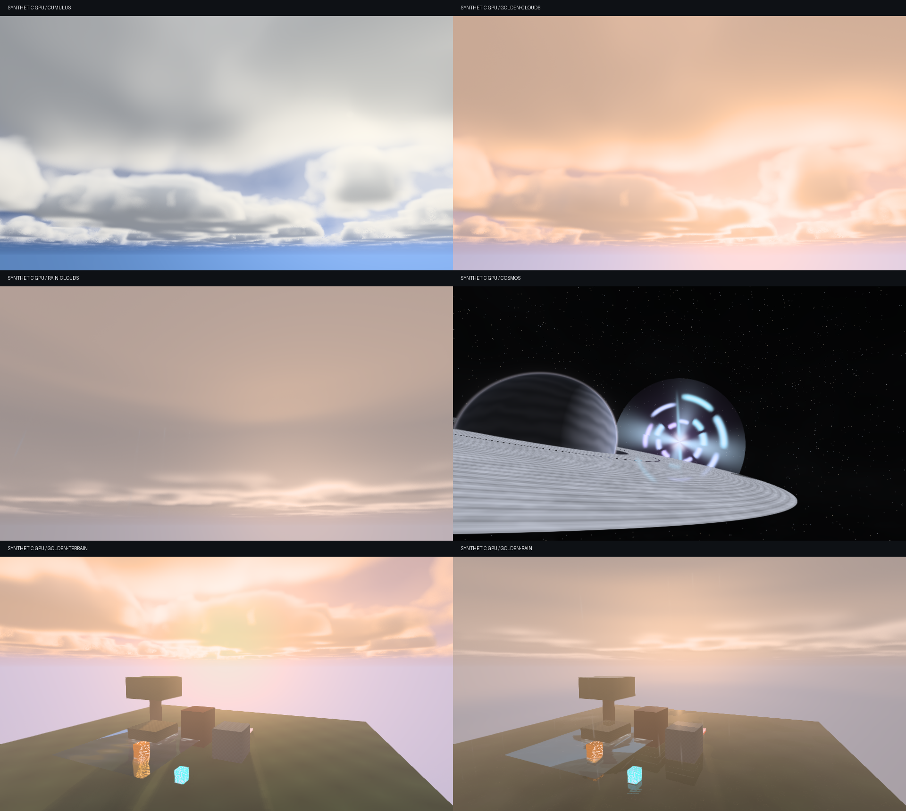
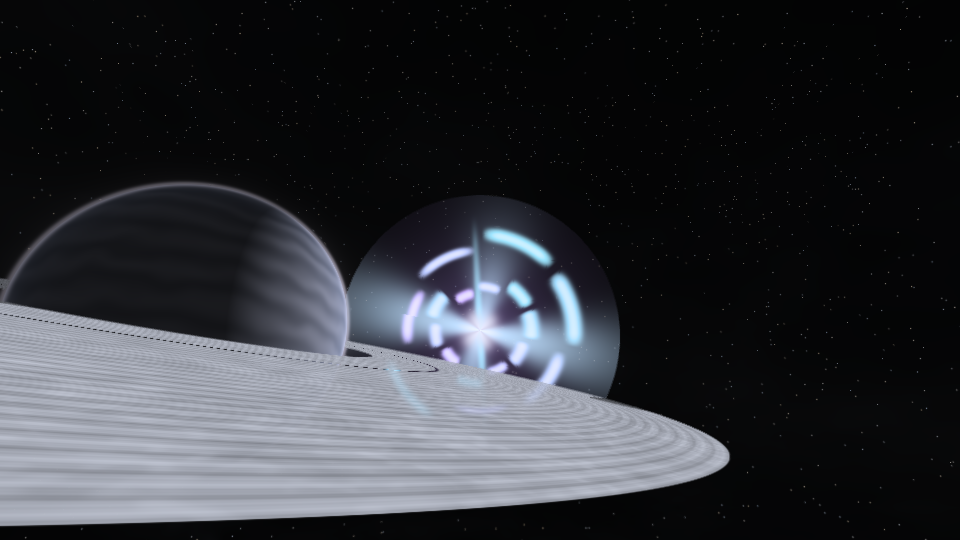

# Galaxy Shader

**Photorealistic Minecraft Shader · 1.12.1 · Community Project**

Galaxy Shader is a natural-color shader pack for Minecraft Java Edition. It uses OpenGL rasterization, shadow mapping, and screen-space effects while keeping block outlines readable. No compilation step is required, no external noise textures are needed, and no extra resource pack is required.

**1.12.1 — parameter alignment against Photon 1.3 defaults:** Ambient occlusion now uses a 2-block world radius with 12 samples at High instead of 18; PCSS shadows follow the reference pack's "three blocker samples plus six to twelve filter taps" range, cutting a lit fragment from 20 to 14 shadow fetches; water adopts its per-block absorption coefficients (water column 0.39/0.14/0.07, underwater 0.20/0.08/0.04) so deep water keeps its blue-green instead of crushing to black and underwater visibility improves; volumetric light mirrors the reference shaft budget by halving its samples once the view is well above the horizon. Every one of these is an equivalent parameter reimplemented here - no Photon code was copied.

**1.12.0 — End rework and Photon-style performance pass:** The End centrepiece is no longer a black hole or wormhole. The former event horizon, photon ring and accretion disk are replaced by a **rift core**: a faceted crystal core, four long diffraction streaks, two counter-facing plasma jets, and two belts of shattered shards driven by angular sectors (each shard hashes its own radius, thickness and tint, and some sectors stay empty). The silhouette is spiked and segmented rather than a round horizon with a smooth dust disk. The giant's limb glow and ring dust move to cold violet-silver tones to match the new ambient light. Budgets across reflections, clouds, water and volumetrics were rebalanced: clouds drop fine noise detail in the far part of the march and use 16/24/36 direct-sky steps, with two longer light samples replacing three short ones; reflections use a single cloud sheet instead of a second volumetric march; water reflects the analytic sky by default and optional screen-space hits moved to the new `WATER_REFLECTIONS` option (on for ULTRA/CINEMATIC); water refraction is one displaced lookup plus at most one extra tap. Cumulative 1280x720 HIGH A/B against 1.11.2: clouds -37.2%, sunset -37.3%, daytime terrain/water -36.9%, rain -51.0%, underwater -36.6%; mean 8-bit difference 0.73-1.18 for clouds/sunset/day/rain and 2.99 underwater (the visible result of the absorption change), and the water draw itself is roughly 90% cheaper. Report: `validation/performance-report.json`; this is not Minecraft FPS.

**1.11.2 — Overworld performance:** Preserves direct-sky cloud detail, shadow resolution, volumetric light and SSR. Medium/High cloud shadows use low-frequency density with mean fine-detail compensation; reflected clouds use half the view steps. Colored light rejects non-emissive samples first, and indirect light skips zero-contribution shading.

**1.11.1 / 1.11.0:** Removes the six legacy End planets and their orbital dust tracks, leaving the ringed giant, the central object and a fixed starfield, and upgrades clouds to three-dimensional billows with edge erosion. The black hole centrepiece of those releases was replaced by the rift core in 1.12.0.

Start with HIGH; use ULTRA for finer clouds. Golden-hour rays require low sunlight and scene occluders. Bundled previews are synthetic GPU renders of the actual shaders, not Minecraft captures or a claim of pixel-identical reference matching.

## Delivery status

The first feature set is implemented and has passed standalone GPU compilation and synthetic-scene render checks. Full in-game acceptance on Minecraft + Iris and measured FPS data are still pending. No claim is made about every GPU or mod combination.

## Previews

1.12.1 synthetic GPU views (not Minecraft captures):

**1.5.0 — weather and atmosphere update:** Adds a dedicated procedural precipitation pass that uses the game's rain geometry while replacing its visible streaks with wind-driven layers, near/far density, and lightning response. Water receives multi-scale expanding and fading ripple rings; upward, sky-exposed block surfaces receive small splash impacts. Stone, paths, wood, and foliage darken smoothly with Iris `wetness`, lose roughness, and gain reflections. Clouds, sky, sun, fog, terrain, water, and volumetric accumulation now respond together to Clear / Cloudy / Rain / Thunderstorm. Dawn/dusk volumetrics ray-march the shadow map and use alternating lit/occluded samples to form shafts through canopy gaps, with automatic midday reduction and an energy cap. Terrain fog combines height fog, lowland/valley noise, and distance haze, stopping at scene depth so foreground walls remain opaque.

**1.6.0 — volumetric clouds, colored light, rainbow, and daily sky variation:** Overworld clouds are upgraded to a ray-marched volumetric field whose base and thickness respond to rain/storms, with forward self-shadowing and silver-lining scatter; low presets keep the single-plane fallback. Emissive blocks now project screen-space colored light onto visible geometry, controlled by `COLORED_LIGHT_QUALITY`. A post-rain rainbow was added, and sky, cloud coverage, and fog density now vary by calendar day.

**1.7.0 — cosmic sky and End planet update:** The End planetary system now has seven planets with dramatically spread orbits, obvious near/far apparent size and orbital-speed differences, and axial rotation decoupled from orbital motion. The Overworld night sky gains a tilted Milky Way band with colored nebulas, low northern aurora, occasional shooting stars, and a distant banded planet, controlled by `COSMIC_SKY_QUALITY`.

**1.7.1 — aurora and shooting-star tuning:** Removes the faint distant planet from the Overworld night sky; the northern aurora is brighter, taller, and more layered, and shooting stars occur more often.

**1.7.2 — softer lighting:** Reduces automatic exposure gain, direct sun intensity, daytime ambient light, and block light, while raising the bloom threshold and lowering bloom strength for a gentler, less blown-out image.

**1.7.3 — volumetric cloud blending:** Reworks the cloud density curve with a wider soft threshold and two soft vertical lobes, adds sky ambient color and horizon/distance soft transitions, and removes the hard detail cutouts for a more integrated sky.

**1.7.4 — water and underwater visibility:** Rain/wind now blur the refracted underwater background and raise surface reflection, making it harder to see into water from land. Underwater vision gains distance blur and stronger absorption, so the surface and land lose focus and become murkier with depth.

**1.8.0 — seasons:** Adds `SEASON_MODE` (Auto / Spring / Summer / Autumn / Winter) and `SEASON_STRENGTH`. Auto follows the calendar year and continuously drives sky, sunlight, ambient light, fog, cloud coverage, and foliage color; a specific season can also be forced for screenshots or themed worlds.

**1.8.1 — End celestial rework:** The seven planets now have far stronger orbit-distance and size contrast, with dust trails along each orbit. Planet night sides receive ambient fill so they no longer read as black holes. The central star is replaced by a single wormhole (dark event horizon, photon ring, and tilted dusty accretion disk), and the ringed giant's rings use layered radial bands and noise clumps instead of a solid ring.

**1.9.0 — celestial events and biome atmosphere:** Adds `CELESTIAL_EVENTS`: calendar-driven meteor showers, comets, aurora storms, a solar eclipse and a rare supernova. Adds `BIOME_BLEND`: temperature and rainfall now shift regional mood — warm desert haze, humid jungle/swamp fog, and colder blue light with stronger aurora in cold biomes.

**1.9.1 — water and cave depth:** Underwater gains blue-green god rays and flowing caustics, shorelines gain wind-driven foam, and water refraction uses stronger depth parallax. Caves gain a faint bioluminescent ambient and drifting motes for more depth in the dark.

**1.10.0 — particles, cloud types, extended weather, surface seasons:** Adds `PARTICLE_LAYER` (pollen/dust, fireflies, spores, snow, hail, embers, cosmic motes), `CLOUD_TYPES` (cumulus/stratus/cirrus/storm anvil), `WEATHER_EFFECTS` (sandstorms, blizzards, fog banks) and `SURFACE_SEASONS` (winter frost/snow, patchier autumn leaves, rain puddles, summer heat shimmer).

**1.4.0 — temporal stability update:** Adds configurable HDR TAA history with camera/depth/screen rejection and a 3×3 YCoCg neighborhood clamp; contact-hardening PCSS shadows; world-radius directional horizon AO; SSR adaptive stepping, thickness handling, hit confidence, and rough reflection resolve; Legacy Filmic, ACES-like, and AgX-like tone mapping; more restrained exposure and bloom; and TAA-aware volumetric jitter. Projection jitter remains disabled to protect hand rendering and Iris compatibility.

End rift core and ringed giant close-up:

**1.3.0 — End planet visual upgrade:** The four End planets now have independent orbits and silhouettes: inner planets orbit faster, outer ones slower, and each has its own orbital distance and apparent size; the ringed giant's rings scale with its radius. Every planet gains a procedural atmospheric glow that peaks at the silhouette, falls off into a soft haze, and keeps only a narrow rim over the disk edge so surface colors stay intact. Glow color and strength vary by planet type (cold blue ocean world, volcanic orange, amber ringed giant, icy blue outer world), with stronger scattering on the side facing the central star. The full GPU compile matrix, all synthetic-scene render regressions, and the End-sky fixture checks were rerun and passed. In-game acceptance and FPS measurements are still pending.

**1.2.0 — performance update:** Overworld cloud shadows are now evaluated per vertex and interpolated, instead of recomputed per fragment with FBM; water fragments return early before the generic lighting pass, removing work that was previously overwritten; PCF shadow sampling drops to 4 taps beyond 60% of the shadow distance, in addition to the existing distance fade. These changes passed the full GPU compile matrix and all synthetic-scene render regressions. In-game acceptance and FPS measurements are still pending.

**1.1.0 — End planetary sky:** Four orbiting planets (including one ringed giant), a central star, and a fixed starfield were added to the End. Movement is driven by view direction and time, with configurable orbital/rotational speed. `END_PLANETS` and `END_ORBIT_SPEED` options were added under a new "End starfield" menu page (Chinese and English), enabled by default and limited to the End dimension. Six synthetic-scene checks passed (foreground occlusion, orbital motion, frozen at zero speed, clock reset consistency at 0.5/1/2× speed, static when disabled, no leakage to other dimensions); in-game acceptance is still pending.

**1.0.2 — buffer format fix:** Buffer-format metadata was moved into Iris-supported multiline comments, fixing `RGBA16F` / `RGBA8` / `R11F_G11F_B10F` being treated as undefined GLSL variables in `deferred.fsh`. The validator no longer injects format macros that the release does not contain. Iris is confirmed to allocate all 7 buffers as expected.

**1.0.1 — clear-color crash fix:** Fixed a load-time crash caused by Iris parsing single-argument `vec4` clear colors. The four clear colors now use four explicit components and pass parsing against real Iris 1.10.9 and 1.11.2 releases.

## Requirements

- Target game: Minecraft Java Edition **26.2**.
- Fabric with the **Iris 1.11.2 + 26.2 Fabric build** and **Sodium 0.9.1 for 26.2**.
- OpenGL 3.3 / GLSL 330 or newer compatibility profile, converted by Iris for the game's core pipeline.
- GPU verification device for this round: NVIDIA GeForce RTX 5080 Laptop GPU, driver 616.64, OpenGL 4.6.
- Minecraft 26.3, Vulkan, OptiFine, Distant Horizons, Voxy, and custom rendering mods are not claimed to be supported.

## Installation

1. Install Minecraft Java 26.2 with the matching Fabric, Iris, and Sodium builds (or use the [Iris installer](https://irisshaders.dev/download/) and select the game version).
2. Put **Galaxy Shader-1.12.1.zip** into that instance's `.minecraft/shaderpacks/` folder. Do not extract it.
3. Launch the Fabric instance and open `Options → Video Settings → Shader Packs`.
4. Select `Galaxy Shader-1.12.1.zip` and click `Apply`.
5. Open the shader settings and choose `HIGH` or `MEDIUM`. Menu labels are provided in both Chinese and English.

The source folder is also installable: copy the whole `Galaxy Shader` directory into `shaderpacks/` so the path resolves to `shaderpacks/Galaxy Shader/shaders/shaders.properties`. Inside the ZIP, files live directly under `shaders/` with no extra nesting.

## Features

| System | Implementation |
| --- | --- |
| Lighting | Dynamic sun/moon direction, warm sunrise/sunset tint, weather attenuation, hemispheric ambient light, minimum cave brightness, held-light approximation |
| Shadows | Stable-grid orthographic map, PCSS blocker search, contact-hardening variable penumbra, static sample rotation, far-distance sample reduction and fade |
| Sky | Rayleigh/Mie phase and optical-thickness approximation, sun/moon disks, stars, day-night gradient, Overworld galaxy band and nebulas, aurora, shooting stars, calendar-driven celestial events |
| End sky | Rift core (faceted crystal core, four diffraction streaks, bipolar plasma jets, two belts of shattered shards), one ringed giant and a fixed starfield; `END_PLANETS` / `END_ORBIT_SPEED`, End only |
| Clouds & weather | Ray-marched volumetric clouds (far samples drop fine noise detail, single-plane fallback on low), cumulus/stratus/cirrus/storm-anvil cloud types, sandstorms/blizzards/fog banks, rain streaks, post-rain rainbow, daily sky variation, smooth wetness accumulation, block splashes, real lightning illumination |
| Air particles | Daytime pollen and dust, night fireflies, forest spores, snow-biome snow, storm hail, Nether embers and End cosmic motes; selected by biome, season, weather and dimension |
| Water | Multi-frequency wave normals (up to three layers), multi-scale expanding/fading rain rings, wind/storm disturbance, storm highlights, Fresnel, analytic sky reflection (`WATER_REFLECTIONS` can add traced hits), one displaced refraction lookup plus one extra tap, Beer-Lambert absorption, shoreline foam, underwater caustics and blue-green volumetrics, deep-water fog |
| Reflections | SSR for wet or LabPBR smooth surfaces; adaptive stepping, thickness/refinement, hit confidence, inexpensive rough resolve, environment fallback |
| Vegetation | Grass, flowers, crops, leaves, vines; world-coordinate and gust-driven motion; matching animation for tall-plant halves and the shadow pass |
| AO / indirect | Directional GTAO-style horizon search with world radius and edge-aware weighting; separate short-range color transport |
| Materials | LabPBR normals, linear roughness, dielectric F0/metal, material AO, emissive read; vanilla parameters when no resource pack provides them |
| Emissives | Torch, lantern, soul fire, lava, redstone, sea lantern, end rod, campfire, lit furnace and other classified emissives; visible emissive surfaces project screen-space colored light onto geometry |
| Atmospheric fog | Depth-occluded height fog, lowland/valley fog, distance haze, and weather/humidity response, with biome temperature/rainfall shifting fog colour and density; warm volcanic fog in the Nether; dark nebula and void fog in the End |
| Volumetric light | Shadow-map ray marching, canopy-contrast shafts, dawn/dusk boost with midday suppression, cloud attenuation, and lightning scatter |
| Post-processing | Restrained HDR bloom, Legacy Filmic / ACES-like / Natural Filmic mapping, bounded exposure and natural white balance |
| Camera | Reprojected TAA history, rejection and YCoCg neighborhood clamp; optional light FXAA, depth of field and camera motion blur |

## Recommended settings and quality presets

Default is `HIGH`: 2048 shadow resolution, 128-block shadow distance, soft shadows, moderate reflections and bloom. Start at 1080p and a 16-chunk render distance, then adjust from the actual frame rate. The table below is a quality budget, not a performance guarantee.

| Preset | Shadow map / distance | Effect budget |
| --- | --- | --- |
| POTATO | 1024 / 64 | TAA/PCSS/SSR/AO/indirect/volumetrics/advanced weather/terrain fog off; four-tap PCF |
| LOW | 1024 / 96 | Low TAA, AO, rain ripples, and terrain fog; PCF; SSR/indirect/volumetrics off |
| MEDIUM | 2048 / 96 | Medium TAA/weather; low PCSS/GTAO/SSR/volumetrics/terrain fog |
| HIGH | 2048 / 128 | Default; high TAA/weather and medium PCSS/GTAO/SSR/volumetrics/terrain fog; 24-step clouds; water reflects the analytic sky |
| ULTRA | 4096 / 192 | Maximum weather/terrain fog and higher PCSS/GTAO/SSR/volumetric budgets; 36-step clouds; water adds traced hits |
| CINEMATIC | 8192 / 256 | 16+24 PCSS, maximum weather/atmosphere/screen-space budgets and screenshot DoF; water adds traced hits |

Lowering `SSR`, `Volumetric Light`, `Cloud quality`, and shadow resolution is usually the fastest way to cut cost. Keeping water reflections on "Sky only" is far cheaper than "Sky + screen space", so leave the default when chasing frame rate. A single 8192² 32-bit depth map is roughly 256 MiB before other Iris targets and caches. Do not use CINEMATIC as a daily setting.

## LabPBR resource packs

`LabPBR materials` defaults to **Auto**: extra material textures are sampled only when a resource pack declares LabPBR through `texture.properties`. Without a resource pack these textures are not sampled, avoiding wrong defaults causing abnormal highlights.

If you are sure a pack is LabPBR 1.3 but does not declare the format, choose **Force LabPBR**. Do not force it on ordinary resource packs. `_n` reads RG normals and AO from the B channel; `_s` reads smoothness from R, reflectance/metal from G, and emissive from A; an emissive alpha of 255 is correctly ignored. Parallax occlusion, displacement, and subsurface texture channels are not implemented.

## Known limitations

- In-game acceptance is still pending; GPU tests use synthetic block scenes and do not include Iris runtime shader translation, real chunk streaming, game UI, mod interoperability, or player input.
- SSR can only reflect **opaque** content already on screen; off-screen content uses an environment approximation. Water refraction is based on the opaque scene; refraction through multiple glass/water layers is not solved recursively.
- Water reflects the analytic sky by default (`WATER_REFLECTIONS` = Sky only), so on-screen trees, hills and buildings do not appear in the water. Choosing "Sky + screen space" adds those traced hits and costs noticeably more at the water pixels.
- A single shadow map is used rather than cascaded shadow maps; thin glass/water does not cast colored shadows. Far shadows fade to sky-lit occlusion; extreme terrain still needs real-game inspection.
- Indirect light and emissives are approximated. Vanilla lightmaps carry no source color; the new colored light comes from screen-space propagation of visible emissive surfaces and cannot reach off-screen or fully occluded sources, so it does not equal Photon's voxel flood-fill / colored GI.
- Overworld clouds are ray-marched along the view ray rather than a 3D voxel cloud field, and distant samples keep only the large billow shape. Flying above the cloud layer, world-coordinate resets, and long-distance travel still need real-game inspection.
- Minecraft/Iris directly exposes Clear, Rain, Thunder, and continuous `rainStrength` / `wetness`. The pack derives its Cloudy mood continuously from configured cloud cover, residual wetness, and light attenuation; it does not add a new game weather type. Surface splash exposure uses skylight and face orientation, so per-drop occlusion under complex overhangs remains approximate.
- TAA does not jitter the projection; moving entities have no dedicated motion vectors and rely on depth, luminance, and neighborhood rejection. Auto-exposure still uses Iris's smoothed eye light rather than a full-scene histogram.
- Terrain and block entities support material normals; ordinary entities and armor do not have full LabPBR reads. Named metals use matching F0 for direct specular highlights, with an Albedo-metal approximation for environment reflections.
- The HUD is not blurred by default; post-processing applies to the world view. The held item has its own mask, but GUI, third person, enchant glints, beacons, and special objects still require in-game acceptance.
- Emissive regions are approximated through material textures or block type/brightness thresholds; fine-grained emissive detail such as furnace sides is less precise than dedicated PBR emissive maps.

## Troubleshooting

- **Pack does not appear in the list:** verify it is in the current launcher instance's `shaderpacks/`, and that the ZIP has `shaders/` at its root.
- **Compile error or black screen:** first disable the shader pack to restore the image, then confirm the Iris/Sodium builds match 26.2. Keep the first shader error from `.minecraft/logs/latest.log`, plus your GPU model and preset, to help diagnose.
- **Too bright or odd reflections:** set `PBR_MODE` to Auto or Off, and check whether the resource pack really is LabPBR.
- **Low frame rate:** switch to MEDIUM/LOW, lower reflections, volumetric light and shadow distance, and disable DoF/motion blur.
- **Screenshot too dark/too bright:** adjust Exposure; disable Eye Adaptation if you need a fixed exposure.
- **Missing off-screen reflections:** that is the screen-space reflection range limit; the pack already includes an environment fallback.

## License / credits

The shader source and documentation are original and released under the [MIT License](Galaxy Shader/LICENSE). No GLSL or textures from other shader packs were copied. The release ZIP does not contain Minecraft, Iris, Sodium, or third-party assets.

Interface references: [Iris docs](https://shaders.properties/current/) and the [LabPBR standard](https://shaderlabs.org/wiki/LabPBR_Material_Standard). Lighting uses public mathematical models such as Fresnel, GGX, Rayleigh/Mie, and Beer–Lambert. The filmic curve is a common ACES fit, not full ACES color management.

Project structure and validation workflow: [ARCHITECTURE.md](Galaxy Shader/ARCHITECTURE.md) · release history: [CHANGELOG.md](Galaxy Shader/CHANGELOG.md) · validation records: [VALIDATION.md](Galaxy Shader/VALIDATION.md)
